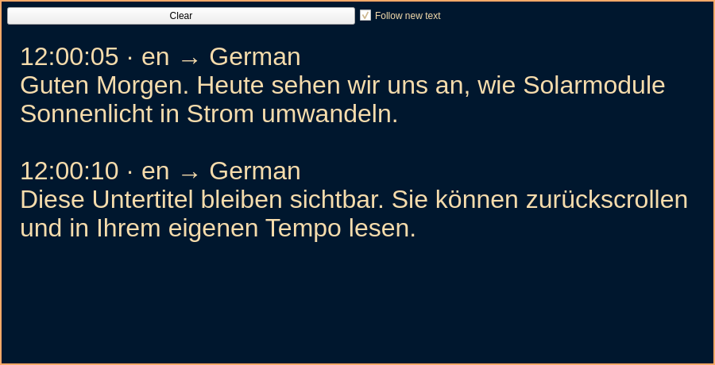

# Video Trans

Live translated captions for Omarchy, from **audio output or an explicitly selected microphone**. Click the bar icon to open a native Omarchy popup using the standard shell controls and layout. Translated text appears in an **independent, resizable floating caption window**. Whisper is the first speech-provider choice; llama.cpp, Ollama or an OpenAI-compatible online API translates the recognized text. German is the default target.



The preview uses synthetic example captions, not a recording.

## Features

- Local multilingual Whisper detects the spoken language automatically, including after a language change. You can override it with a language code.
- Choose **Audio output** or **Microphone**. Output mode only enumerates sink monitors; microphone mode only enumerates non-monitor sources. No microphone or output fallback.
- FFmpeg speech-band filtering and optional adaptive FFT noise suppression, followed by Silero voice activity detection and Whisper confidence checks. These reduce false captions; they cannot completely separate speech from music or other voices.
- Separate speech-model and translation-model selectors. Whisper runs on CPU with int8, leaving GPU memory for your translator.
- Local llama.cpp router and Ollama support automatic service startup, model discovery and model cleanup. **Auto-select local model** considers the target language, multilingual model family and model size, excluding speech-synthesis, embedding and coding-only models. This is an editable heuristic suggestion, not a quality benchmark.
- Online endpoint, model and masked API-key / bearer-token configuration. Compatible with the `/v1/models` and `/v1/chat/completions` protocols, rather than every provider's proprietary API.
- A native Omarchy popup for settings and translation controls, independent of the caption window. Its appearance always follows the shell's default panel components and theme.
- A resizable floating caption window with adjustable font size, background transparency and border thickness. These appearance controls affect **only the overlay**, never the native widget/panel. Overlay background, text and border colors follow the active Omarchy theme; transparency and border thickness default to the theme's popup settings and can be overridden. Text stays opaque as background transparency changes. Theme changes are picked up while the window is open. Captions do not time out; a bounded scrollback retains 500 paragraphs by default, configurable up to 5,000. Disable **Follow new text** to read older captions without being scrolled away.
- Stop releases the speech worker while keeping captions visible. Close releases owned resources and exits the GUI.

## Install

Requires current Omarchy shell plugin support, PipeWire-Pulse, FFmpeg and `uv`:

```bash
omarchy pkg add ffmpeg libpulse uv
omarchy plugin add https://github.com/uBruckhaus/omarchy-video-trans.git --enable
bash ~/.config/omarchy/plugins/ubruckhaus.video-trans/setup.sh
```

Omarchy does not execute plugin setup hooks. Run setup explicitly; it downloads an isolated Python 3.12 runtime and pinned dependencies under `~/.local/share/video-trans/runtime`. First **Start** downloads the selected Whisper model from Hugging Face. Downloads can be cancelled by Stop or Close. A filesystem path to an existing faster-whisper / CTranslate2 model can also be entered in the Whisper-model field. Models such as `tiny.en` are English-only; choose a multilingual model for automatic language detection.

For Omarchy's Lua Hyprland configuration, add to `~/.config/hypr/hyprland.lua`:

```lua
-- Video Trans floating caption window
o.window({ title = "^Video Trans — Live captions$" }, { float = true, pin = true, border_size = 0, opacity = "1 1" })
```

Then validate with `hyprctl reload` and `hyprctl configerrors`. The pinned window follows workspaces; position it above or below your video and resize with your normal Hyprland controls. It is a floating application window, not an embedded player subtitle track. Fullscreen stacking depends on your compositor; use a windowed/maximized video if your fullscreen player covers captions.

## Use

1. Click **Video Trans** in the bar to open its standard Omarchy popup.
2. Whisper appears first as the speech provider. Choose the audio input type and device. For videos use **Audio output** and select the device carrying playback. This captures all applications playing through that output; close or mute unrelated audio.
3. Keep source language **auto**, select a target language and a multilingual Whisper model.
4. Select your translation provider and click **Start provider / refresh models**. Choose a text model, or click **Auto-select local model for target language**. When Online is selected, Auto-select detects an installed llama.cpp or Ollama, switches to it and suggests an available model. It does not download new translation models or load one for a benchmark. Synthesis/tokenizer models are excluded. A small instruction model is usually more responsive than a large reasoning model.
5. Click **Start** to open the separate caption window and begin translation. **Show captions** opens it without starting capture. Closing the popup leaves a visible overlay and translation running. Resize/move the overlay independently, and disable **Follow new text** to read at your own pace. Stop retains text; Clear removes it. Closing the overlay stops capture, releases owned models/services and exits its process.

Expand **Provider and recognition settings** for endpoints, authentication and advanced speech options. Expand **Caption overlay appearance** for transparency, border and reading controls; `−1` uses the current Omarchy theme default. Hiding the popup when no overlay is open releases the idle controller and any service it started for model discovery.

Audio is processed in overlapping 5-second chunks by default. Larger chunks improve sentence context but increase latency. If inference cannot keep up, a bounded audio queue drops older chunks and reports this in the status line. Text is not synchronized to a delayed video. Source-language detection can be uncertain for short/noisy speech; select a source-language override when needed.

## Providers and authentication

### llama.cpp

Default endpoint: `http://127.0.0.1:8080`. Requires a configured **user** service named `llama-server.service` and a router exposing model discovery, chat completions and `/models/unload`. Video Trans uses your existing installation and model presets; it does not install llama.cpp or download translation models.

If the endpoint is already reachable, no service is started. Otherwise Video Trans starts the user service. On Stop or Close it unloads models it used that were not already loaded at discovery, then stops a service it started. Pre-existing loaded models and pre-existing services are retained. An older single-model server lacking router status/unload is treated as shared and is not forcibly stopped.

### Ollama

Default endpoint: `http://127.0.0.1:11434`. If unreachable, Video Trans tries the `ollama.service` user unit, then launches its own `ollama serve` child if no user unit is available. Install Ollama and pull models yourself first. Video Trans never starts or stops a system-wide Ollama service.

Models newly used by Video Trans are unloaded using `keep_alive: 0`. Pre-existing loaded models are retained. An owned Ollama process/service is stopped. A remote local-provider endpoint is used directly and no local service is started.

### Online

Enter an OpenAI-compatible HTTPS base URL (with or without `/v1`), a model and an **API key or existing bearer access token**. The key is sent as `Authorization: Bearer …`. If your provider does not expose model discovery, enter the model manually and click Start.

Browser OAuth sign-in, subscription-login scraping, provider-specific APIs and automatic token refresh are not implemented. Use a provider-issued API key or a valid access token from an authentication flow you manage. HTTP with credentials is accepted only for loopback endpoints; use HTTPS remotely.

Whisper still processes audio locally. **Only recognized text is sent to the selected translation endpoint**, including for online providers. Online API charges are governed by your provider account. No translation requests occur until Start.

## Resource lifecycle and local data

- The shell widget loads no AI model. Simply opening the native popup reads settings/device metadata without starting the overlay process. Changing settings or requesting an action starts a separate hidden caption controller as needed; refreshing models may start the selected local service, but does not itself request inference. Closing a popup without an open overlay releases that controller. A private owner-only local socket connects the native panel and caption process; token values are never returned in panel status responses.
- Stop terminates capture, completes any in-flight inference request, unloads owned translation models, stops owned services and exits the speech worker process. Close hides the window immediately and waits asynchronously for this cleanup before exiting.
- Model downloads run as cancellable children. Ordinary provider requests have a 60-second read timeout; service shutdown may take up to 70 seconds. Stop/Close may take time while an inference request finishes.
- The GUI process releases its memory on exit. Previously loaded/shared translation models remain loaded intentionally. There is no cross-application model lease protocol: another application using a model newly loaded by Video Trans can be affected by that model's unload; use a dedicated endpoint when sharing concurrent workloads.
- Forced process kills, machine power loss and a provider refusing its unload API can prevent graceful cleanup. The status line reports cleanup errors when available.

| Data | Default location |
| --- | --- |
| Preferences | `~/.config/video-trans/settings.json` |
| Optional saved API keys/tokens | `~/.config/video-trans/credentials.json` (0600) |
| Isolated Python runtime | `~/.local/share/video-trans/runtime/` |
| Whisper models | Hugging Face cache, usually `~/.cache/huggingface/hub/` |
| Captions/audio | In memory only; not saved to disk |

XDG config/data paths are respected. Credentials are stored only if **Save token locally** is selected; the file is owner-only plaintext, not an encrypted keychain. Provider tokens never go into the repository or settings file. No telemetry. Credentials and preferences remain after removing the plugin.

## Development and checks

```bash
bash setup.sh
~/.local/share/video-trans/runtime/bin/python -m unittest discover -s tests -v
omarchy plugin validate .
bash -n setup.sh launch.sh
```

Tests cover device-type isolation, capture filters, provider protocols, ownership cleanup, credential permissions, target-sensitive model suggestions, Omarchy theme defaults, appearance overrides, plain-text caption rendering, retained captions and asynchronous close. They do not require models, audio capture or paid API calls. A full local integration check also passed: playback through a temporary silent sink → noise filtering → Whisper English detection → Gemma German translation → worker/service cleanup. Whisper rejected a synthetic non-speech noise sample. Online and Ollama integration need their respective accounts/installations.

See [MARKETPLACE.md](MARKETPLACE.md) for listing details. MIT licensed. Independent community plugin.
